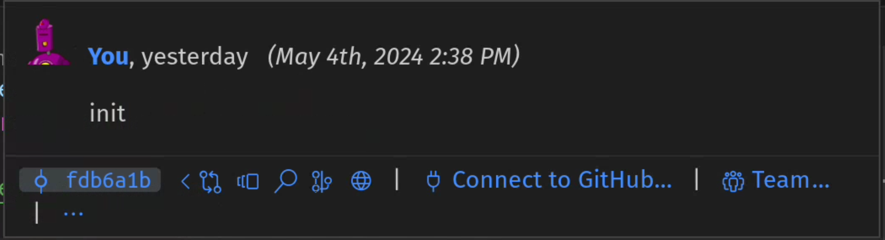
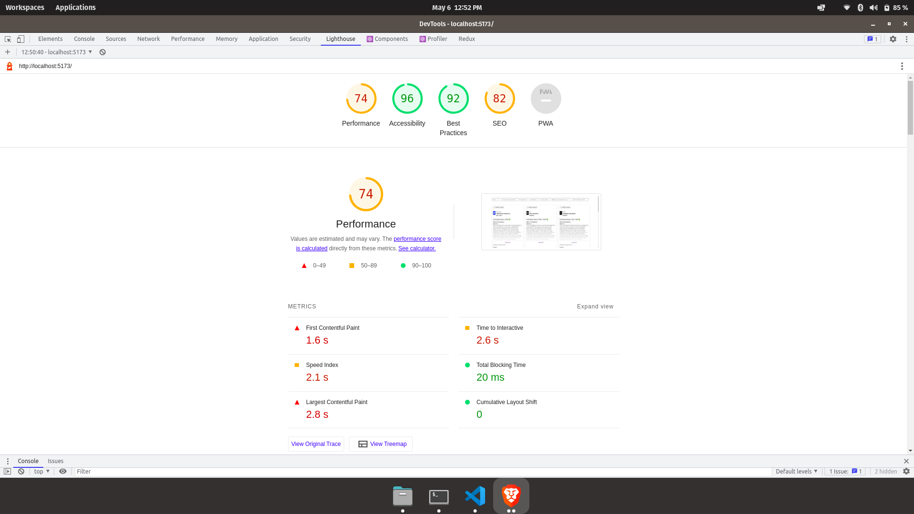

### All the instructions to run the application is provided in the file [Instructions.md](/Instructions.md)

#### This application is created using React with redux and the UI is made only using CSS. Material UI is used only for icons.

#### Extra features implemented:
1. Added a skeleton for page load.
2. Added a loading message for infinite scroll.

#### This project was started on 4th May, 2024.
Below is the screenshot of the time details for first commit 'init' using gitlens vscode extension.

#### Lighthouse report:

